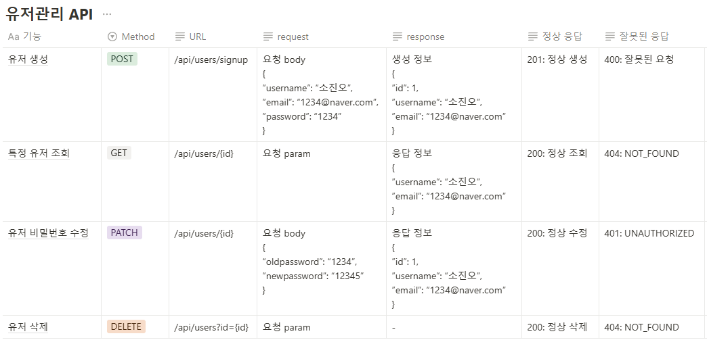

# ScheduleProjectV2

**프로젝트 소개**
- 일정관리 앱을 구현함으로 Spring 핵심 컨셉과 Validation에 대해 학습합니다.
- 인증과 인가에 대해 배워 어플리케이션의 보안과 접근을 제어하는 방법을 다룹니다. 또 Servlet Filter와 Cookie/Session을 사용하여 인증과 인가를 구현합니다.
- 이번 프로젝트를 통해 JPA를 본격적으로 다루며 연관관계 설정, CRUD 등을 배우면서 JPA의 주요 개념을 이해하고, 실제 어플리케이션에 적용하는 방법을 배웁니다.
- 이번 프로젝트를 통해 JPA를 활용한 데이터베이스 관리와 Cookie/Session을 활용한 인증/인가를 이해하는 것이 목표이다.

**요구사항**
- 모든 테이블은 고유 식별자(ID)를 가집니다.
- `3 Layer Architecture` 에 따라 각 Layer의 목적에 맞게 개발합니다.
- CRUD 필수 기능은 모두 데이터베이스 연결 및 `JPA`를 사용해서 개발합니다.
- 인증/인가 절차는 `Cookie/Session`을 활용하여 개발합니다.
- JPA 연관관계는 `단방향` 입니다. 정말 필요한 경우에만 `양방향` 적용한다.

### Lv 0. API 명세 및 ERD 작성

- [ ]  **API 명세서 작성하기**
    - [ ]  API명세서는 프로젝트 root(최상위) 경로의 `README.md` 에 작성

- [ ]  **ERD 작성하기**
    - [ ]  ERD는 프로젝트 root(최상위) 경로의 `README.md` 에 첨부

- [ ]  **SQL 작성하기**
    - [ ]  설치한 데이터베이스(Mysql)에 ERD를 따라 테이블을 생성

### Lv 1. 일정 CRUD

- [ ]  일정을 생성, 조회, 수정, 삭제할 수 있습니다.
- [ ]  일정은 아래 필드를 가집니다.
    - [ ]  `작성 유저명`, `할일 제목`, `할일 내용`, `작성일`, `수정일` 필드
    - [ ]  `작성일`, `수정일` 필드는 `JPA Auditing`을 활용합니다. → `3주차 JPA Auditing 참고!`

### Lv 2. 유저 CRUD

- [ ]  유저를 생성, 조회, 수정, 삭제할 수 있습니다.
- [ ]  유저는 아래와 같은 필드를 가집니다.
    - [ ]  `유저명`, `이메일`, `작성일` , `수정일` 필드
    - [ ]  `작성일`, `수정일` 필드는 `JPA Auditing`을 활용합니다.
- [ ]  연관관계 구현
    - [ ]  일정은 이제 `작성 유저명` 필드 대신 `유저 고유 식별자` 필드를 가집니다.

### Lv 3. 회원가입

- [ ]  유저에 `비밀번호` 필드를 추가합니다.
    - 비밀번호 암호화는 도전 기능에서 수행합니다.

### Lv 4. 로그인(인증)

  **인터페이스**

    - HttpServletRequest / HttpServletResponse : 각 HTTP 요청에서 주고받는 값들을 담고 있습니다.
- [ ]  **설명**
    - [ ]  **Cookie/Session**을 활용해 로그인 기능을 구현합니다. → `2주차 Servlet Filter 실습 참고!`
    - [ ]  필터를 활용해 인증 처리를 할 수 있습니다.
    - [ ]  `@Configuration` 을 활용해 필터를 등록할 수 있습니다.
- [ ]  **조건**
    - [ ]  `이메일`과 `비밀번호`를 활용해 로그인 기능을 구현합니다.
    - [ ]  회원가입, 로그인 요청은 인증 처리에서 제외합니다.
- [ ]  **예외처리**
    - [ ]  로그인 시 이메일과 비밀번호가 일치하지 않을 경우 HTTP Status code 401을 반환합니다.

**API 명세서**

**ERD**
